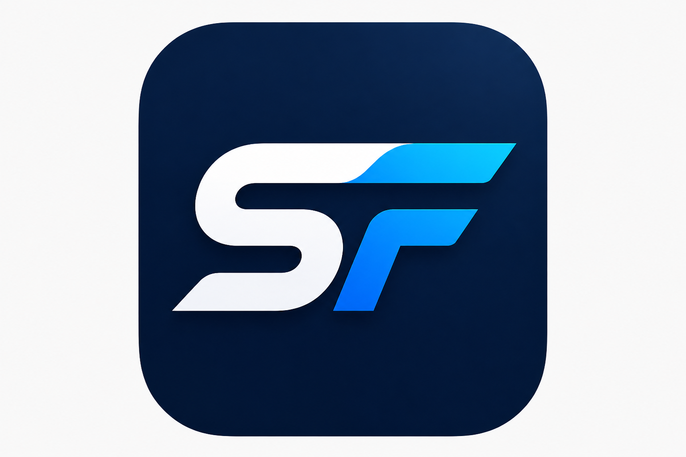

# StockFlow

**Manage smarter.** A desktop stock management application for small businesses — track inventory, scan QR codes, record sales, and analyze performance from one offline-first app.

<p align="center">
  
</p>

<p align="center">
  
  
  
  
  
</p>

---

## Overview

StockFlow is a cross-platform desktop app built with **Electron**, **React**, and **SQLite**. All data stays on your machine — no cloud account required. It is designed for shops, boutiques, and small retailers who need practical inventory tracking, fast checkout via barcode/QR scanning, and clear sales reports.

| | |
|---|---|
| **App name** | StockFlow |
| **Version** | 0.1.0 |
| **Default currency** | DZD (configurable) |
| **Data storage** | Local SQLite (`stockflow.db`) |

---

## Features

### Inventory & products

- Create and manage products with **categories**, **cost/sell prices**, and **low-stock thresholds**
- Support for **product variants** (size, color, expiry date, etc.) via built-in category templates
- Auto-generated **SKU** and **QR codes** for each variant
- **Print labels** (60×40 mm) with product name, attributes, QR code, and SKU
- **Archive** products with reason tracking and one-click restore

### Stock management

- Real-time stock levels per variant
- Stock movements: sales, restocks, adjustments, losses, and returns
- Low-stock alerts on the dashboard (configurable)
- Stock overview with filtering and quick adjustments

### Scanner & sales

- **Camera scanner** or **manual SKU entry** to look up products
- Record sales with quantity, buyer name, and optional notes
- Session stats (sales count and revenue) while scanning
- Configurable auto-confirm, default quantity, and buyer-name prompts

### Dashboard & analytics

- At-a-glance stats: revenue, sales, products, and stock health
- Weekly revenue chart and recent sales feed
- Low-stock warnings with quick links to restock

### Reporting & economy

- Daily and weekly summaries
- Top products and top buyers
- Category breakdown, hourly sales patterns, and period comparison
- Economy insights: slow movers, profitable variants, category performance

### Settings & data

- Currency (DZD, USD, EUR, GBP, MAD, TND), date format, and language preferences
- **Export / import** full database backups
- Dark theme (default)

### Authentication

- Local user accounts with bcrypt password hashing
- Register, login, and password recovery flows
- Per-user settings and isolated product data

### Coming soon

- **Workers** — team management, roles, and activity tracking (Premium)

---

## Screenshots

> Add screenshots of the dashboard, products, scanner, and reports here before publishing.

| Dashboard | Scanner | Reports |
|:---:|:---:|:---:|
| _screenshot_ | _screenshot_ | _screenshot_ |

---

## Tech stack

| Layer | Technologies |
|---|---|
| Desktop shell | [Electron](https://www.electronjs.org/) 35 |
| UI | [React](https://react.dev/) 19, [React Router](https://reactrouter.com/) 6 |
| Language | [TypeScript](https://www.typescriptlang.org/) |
| Build | [Vite](https://vitejs.dev/) 7, [electron-vite](https://electron-vite.org/) |
| Styling | [Tailwind CSS](https://tailwindcss.com/) 4 |
| Database | [Node.js SQLite](https://nodejs.org/api/sqlite.html) (WAL mode, local file) |
| Charts | [Recharts](https://recharts.org/) |
| Scanning | [html5-qrcode](https://github.com/mebjas/html5-qrcode) |
| QR generation | [qrcode](https://www.npmjs.com/package/qrcode) |
| Icons | [Lucide React](https://lucide.dev/) |

---

## Prerequisites

- **Node.js** 20 or later (LTS recommended)
- **npm** 10+
- **Git**

Platform-specific build tools (only needed for `npm run build`):

| Platform | Requirements |
|---|---|
| **Windows** | No extra tools for NSIS installer |
| **macOS** | Xcode Command Line Tools (for native modules) |
| **Linux** | `rpm`, `dpkg`, or equivalent for AppImage packaging |

---

## Getting started

### 1. Clone the repository

```bash
git clone https://github.com/reportJNG/Gestion-stock-free-app-.git
cd Gestion-stock-free-app-
```

### 2. Install dependencies

```bash
npm install
```

### 3. Run in development

```bash
npm run dev
```

This starts the Electron app with hot reload for the renderer and rebuilds for the main/preload processes.

### 4. Create your account

On first launch, use **Register** to create a local account. All inventory data is tied to that user.

---

## Scripts

| Command | Description |
|---|---|
| `npm run dev` | Start the app in development mode |
| `npm run build` | Build the app and package installers with electron-builder |
| `npm run preview` | Preview the production build locally |
| `npm run typecheck` | Run TypeScript type checking without emitting files |

---

## Building for production

```bash
npm run build
```

Installers are written to the `release/` directory:

| Platform | Output |
|---|---|
| Windows | NSIS installer (`.exe`) |
| macOS | Disk image (`.dmg`) |
| Linux | AppImage |

Build targets are configured in [`electron-builder.yml`](electron-builder.yml).

---

## Keyboard shortcuts

Shortcuts work when you are logged in and not focused on an input field.

| Shortcut | Action |
|---|---|
| `Ctrl+1` | Dashboard |
| `Ctrl+2` | Products |
| `Ctrl+3` | Stock |
| `Ctrl+4` | Scanner |
| `Ctrl+5` | Reports |
| `Ctrl+6` | Economy |
| `Ctrl+,` | Settings |
| `Ctrl+L` | Log out (with confirmation) |

---

## Project structure

```
Desk-app-gestion-stock/
├── electron/
│   ├── main.ts              # Electron main process, IPC handlers, window management
│   ├── preload.ts           # Secure bridge between renderer and main process
│   └── db/
│       ├── database.ts      # SQLite queries and business logic
│       └── migrations.ts    # Schema, indexes, and seed data
├── src/
│   ├── components/          # Reusable UI, layout, and feature components
│   ├── hooks/               # Data fetching and app logic hooks
│   ├── routes/              # Page-level React components (one per screen)
│   ├── store/               # Auth and theme context
│   ├── utils/               # Formatting, labels, insights helpers
│   ├── constants/           # App name, developer info
│   ├── styles/              # Global CSS (Tailwind + custom tokens)
│   ├── App.tsx              # Route definitions
│   └── main.tsx             # React entry point
├── public/                  # Static assets (icons, images)
├── scripts/                 # Dev/build runner scripts
├── electron-builder.yml     # Packaging configuration
├── electron.vite.config.ts  # Electron + Vite build config
└── package.json
```

---

## Data & privacy

- The SQLite database is stored locally as `stockflow.db` inside the app's user-data folder (`.stockflow-data/` relative to the working directory).
- Open **About** inside the app to see the exact `userDataPath` and `dbPath` on your machine.
- Data never leaves your machine unless you explicitly export a backup.
- Use **Settings → Data & Privacy** to export or import `stockflow.db`.

### Database schema (summary)

| Table | Purpose |
|---|---|
| `users` | Local accounts |
| `products` | Product catalog |
| `product_variants` | SKUs, attributes, QR payload |
| `stock` | Current quantity per variant |
| `stock_movements` | Audit trail of stock changes |
| `sales` | Recorded sales transactions |
| `buyers` | Buyer stats aggregated from sales |
| `archives` | Soft-deleted product snapshots |
| `app_settings` | Per-user preferences |
| `category_templates` | Predefined category attribute schemas |

---

## Category templates

StockFlow ships with templates for common retail categories:

Clothing · Shoes · Food · Beverage · Electronics · Cosmetics · Pharmacy · Furniture · Books · Other

Each template defines variant attributes (e.g. size and color for clothing, expiry date for food).

---

## Development notes

- **Path alias:** `@/` maps to `src/` (see `electron.vite.config.ts`).
- **IPC API:** The renderer accesses the database through `window.api` exposed in `electron/preload.ts`. Do not enable Node integration in the renderer.
- **Migrations:** Schema changes belong in `electron/db/migrations.ts` and run automatically on startup.
- **Dev user data:** During development, Electron may use a separate user-data folder (e.g. `.stockflow-data/` in the project root).

---

## Troubleshooting

| Issue | Suggestion |
|---|---|
| App won't start after `npm install` | Delete `node_modules` and `package-lock.json`, then run `npm install` again |
| Camera not working in Scanner | Grant camera permission to the app; use manual SKU entry as fallback |
| Database seems stale after import | Restart the app after importing a backup |
| Build fails on Windows | Run the terminal as a normal user; avoid paths with special characters |

---

## Roadmap

- [ ] Workers & role-based access (Premium)
- [ ] Additional language support
- [ ] Light theme and theme switcher
- [ ] Multi-store / multi-location support

---

## Author

**Hamza Remali** — Full Stack Developer · Electron · React · Mobile

- GitHub: [@reportJNG](https://github.com/reportJNG)
- LinkedIn: [hamza-remali](https://www.linkedin.com/in/hamza-remali-6b3782375/)
- Email: [hamzaremali10@gmail.com](mailto:hamzaremali10@gmail.com)
- WhatsApp: [+213 774 27 38 61](https://wa.me/213774273861)

For premium features (Workers, custom deployments, or business integrations), contact the author via email or WhatsApp.

---

## License

This project is **private** and **unlicensed**. All rights reserved. Contact the author for licensing or commercial use.

---

<p align="center">
  Built with Electron · React · TypeScript · SQLite
</p>
